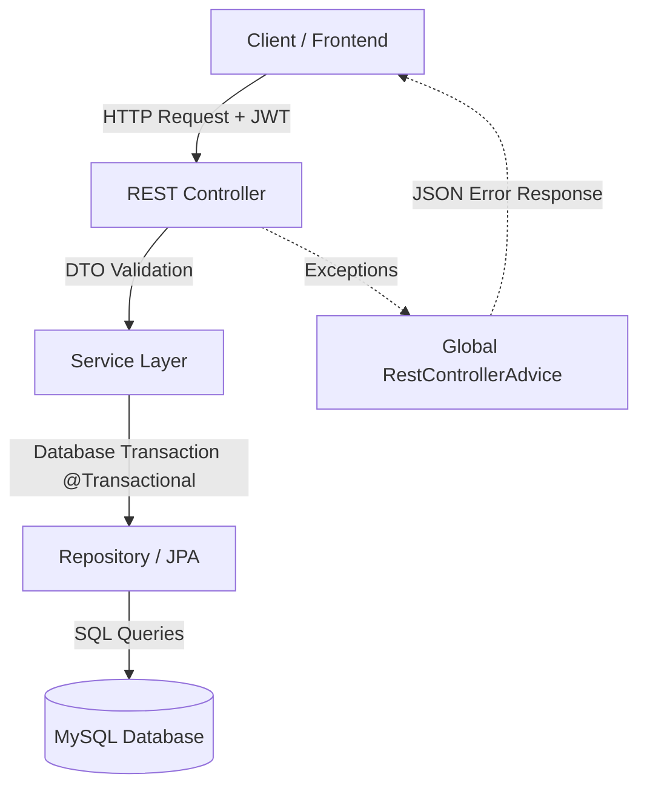

# EventHub Backend API

Welcome to the backend service of **EventHub**, a robust, production-ready Event Management System. This service is built using **Java Spring Boot**, featuring high-performance database transactions, stateless JWT security, and structured global error handling.

---

##  Tech Stack & Architecture

- **Core Framework**: Spring Boot (Java 11+)
- **Security**: Spring Security & stateless JWT (JSON Web Token) authentication
- **Database ORM**: Hibernate / Spring Data JPA
- **Database**: MySQL 8.0+
- **Validation**: Spring Boot Starter Validation (DTO constraint enforcement)



---

##  Project Structure

```text
backend/
├── src/main/java/com/educountry/eventhub/
│   ├── config/           # CORS & Application Configurations
│   ├── controller/       # REST API Endpoints (Controllers)
│   ├── dto/              # Standard Request & Response DTOs
│   ├── exception/        # Custom Exceptions & Global Handler
│   ├── model/            # JPA Entities (Database Schema)
│   ├── repository/       # Data Access Layer (JPA Repositories)
│   ├── security/         # JWT Utilities, Filters, and BCrypt configuration
│   └── service/          # Business Logic & Service Interfaces
└── src/main/resources/   # application.properties (Configuration templates)
```

---

##  Setup & Configuration

This project is configured to read sensitive values and database credentials from environment variables to maintain maximum security.

### 1. Configure Environment Variables
Copy the `.env.example` file to a new file named `.env`:
```bash
cp .env.example .env
```

Open the newly created `.env` file and replace the placeholders with your local MySQL credentials and server configurations:
```env
# Database Credentials
SPRING_DATASOURCE_URL=jdbc:mysql://localhost:3306/eventhub_db?useSSL=false&serverTimezone=UTC&allowPublicKeyRetrieval=true
SPRING_DATASOURCE_USERNAME=your_database_username
SPRING_DATASOURCE_PASSWORD=your_database_password

# Server Settings
SERVER_PORT=8080
```

*Note: The `.env` file is ignored by Git in `.gitignore` to prevent any accidental credential leaks.*

---

##  Running the Application

### Prerequisites
* Java JDK 11 or higher installed
* MySQL Server 8.0+ running locally

### Steps to Run
1. Create the MySQL database:
   ```sql
   CREATE DATABASE eventhub_db;
   ```
2. Navigate to the `backend` folder:
   ```bash
   cd backend
   ```
3. Boot the application using the Maven wrapper:
   ```bash
   ./mvnw spring-boot:run
   ```
The application will start, automatically generate all database tables, and run on `http://localhost:8080`.

---

##  Key Features

###  Stateless JWT Authentication
All requests under `/api/**` (except registration and login routes under `/api/auth/**`) require a valid JWT token passed in the header:
```http
Authorization: Bearer <your_jwt_token>
```

###  Transaction Safety
Critical database modifications (like ticket booking or slot decrementing) are fully protected with `@Transactional` tags to prevent double-booking anomalies or race conditions.

###  Uniform JSON Responses
All API endpoints yield a standard response signature:
```json
{
  "success": true,
  "message": "Operation completed successfully",
  "data": { ... }
}
```
If an error occurs, the `@RestControllerAdvice` intercepts it and responds with a standard 4xx or 5xx structured error JSON.
